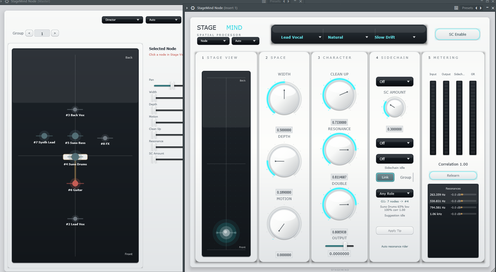

# StageMind

StageMind is a FL Studio-first VST3 insert effect for role-aware stem mixing.

The MVP artifact is `StageMind Node.vst3`.

## License

StageMind is source-available, not open-source under a permissive license.

Personal testing, learning, and internal evaluation are allowed. Commercial use
requires prior written permission from the author. See `LICENSE`.

## MVP Status

Current scope: MVP4 Spatial and MVP5 StageMind Link foundation are finalized. StageMind Node 0.11.3 makes manual intent stronger: Static/Off Stage Gain blocks Director Output Trim automation, manual ducking bypass is respected, Director trim is capped to +/-3 dB, and idle logging is quieter.

Current UI direction: bright hardware processor interface with a rounded white chassis, dark glass selector strip, five vertical modules, cyan glow accents, segmented meters, dotted Stage View grid, and custom knob/dropdown/button styling.



Finalization note: `docs/MVP4_MVP5_FINALIZATION.md`.
0.5.5 RC note: `docs/STAGEMIND_NODE_0_5_5_RC.md`.
0.5.6 RC note: `docs/STAGEMIND_NODE_0_5_6_RC.md`.
0.5.7 RC note: `docs/STAGEMIND_NODE_0_5_7_RC.md`.
0.5.8 RC note: `docs/STAGEMIND_NODE_0_5_8_RC.md`.
0.5.9 RC note: `docs/STAGEMIND_NODE_0_5_9_RC.md`.
0.6.0 RC note: `docs/STAGEMIND_NODE_0_6_0_RC.md`.
0.6.1 RC note: `docs/STAGEMIND_NODE_0_6_1_RC.md`.
0.6.2 RC note: `docs/STAGEMIND_NODE_0_6_2_RC.md`.
0.7.0 RC note: `docs/STAGEMIND_NODE_0_7_0_RC.md`.
0.7.1 RC note: `docs/STAGEMIND_NODE_0_7_1_RC.md`.
0.7.2 RC note: `docs/STAGEMIND_NODE_0_7_2_RC.md`.
0.7.3 RC note: `docs/STAGEMIND_NODE_0_7_3_RC.md`.
0.8.0 RC note: `docs/STAGEMIND_NODE_0_8_0_RC.md`.
0.8.1 RC note: `docs/STAGEMIND_NODE_0_8_1_RC.md`.
0.8.2 RC note: `docs/STAGEMIND_NODE_0_8_2_RC.md`.
0.8.3 RC note: `docs/STAGEMIND_NODE_0_8_3_RC.md`.
0.8.4 RC note: `docs/STAGEMIND_NODE_0_8_4_RC.md`.
0.8.5 RC note: `docs/STAGEMIND_NODE_0_8_5_RC.md`.
0.8.6 RC note: `docs/STAGEMIND_NODE_0_8_6_RC.md`.
0.8.7 RC note: `docs/STAGEMIND_NODE_0_8_7_RC.md`.
0.8.8 RC note: `docs/STAGEMIND_NODE_0_8_8_RC.md`.
0.8.9 RC note: `docs/STAGEMIND_NODE_0_8_9_RC.md`.
0.9.0 RC note: `docs/STAGEMIND_NODE_0_9_0_RC.md`.
0.9.1 RC note: `docs/STAGEMIND_NODE_0_9_1_RC.md`.
0.9.2 RC note: `docs/STAGEMIND_NODE_0_9_2_RC.md`.
0.9.3 RC note: `docs/STAGEMIND_NODE_0_9_3_RC.md`.
0.9.4 RC note: `docs/STAGEMIND_NODE_0_9_4_RC.md`.
0.9.5 RC note: `docs/STAGEMIND_NODE_0_9_5_RC.md`.
0.9.6 RC note: `docs/STAGEMIND_NODE_0_9_6_RC.md`.
0.9.7 RC note: `docs/STAGEMIND_NODE_0_9_7_RC.md`.
0.9.8 RC note: `docs/STAGEMIND_NODE_0_9_8_RC.md`.
0.9.9 RC note: `docs/STAGEMIND_NODE_0_9_9_RC.md`.
0.10.0 RC note: `docs/STAGEMIND_NODE_0_10_0_RC.md`.
0.11.0 RC note: `docs/STAGEMIND_NODE_0_11_0_RC.md`.
0.11.1 RC note: `docs/STAGEMIND_NODE_0_11_1_RC.md`.
0.11.2 RC note: `docs/STAGEMIND_NODE_0_11_2_RC.md`.
0.11.3 RC note: `docs/STAGEMIND_NODE_0_11_3_RC.md`.

Implemented in this repository:

- JUCE/CMake project skeleton.
- VST3 target.
- Main stereo input/output.
- Optional stereo sidechain input bus named `Sidechain`.
- APVTS registry with the canonical parameters from the technical spec.
- Basic processor/editor split.
- MVP 1 spatial DSP path:
  - output trim;
  - Mid/Side width;
  - mono low-end;
  - side high-pass;
  - input/output/sidechain meters;
  - correlation snapshot.
- MVP 2 sidechain path:
  - sidechain envelope detection;
  - SidechainDynamicEQ;
  - Vocal Ducks Instrument;
  - Kick Ducks Bass;
  - Snare Ducks Instrument;
  - Lead Ducks Pad;
  - Custom sidechain range;
  - Sidechain Listen Off / Sidechain Only;
  - gain-reduction meter.
- MVP 3 local resonance path:
  - Hann-window FFT resonance detector;
  - short resonance hold to stop GUI/list flicker;
  - runtime Learn button for stable local resonance corrections;
  - fixed top-4 resonance peak list;
  - DynamicEQ resonance suppression;
  - Resonance List in the GUI;
  - Clean Up macro mapped to detector threshold;
  - Resonance macro mapped to suppression amount;
  - focused DSP tests with artificial peaks.
- Stage Gain 0.10.0:
  - `Off`, `Static`, and `Ride` modes;
  - `Target`, `Threshold`, `Ceiling`, and `Response` controls;
  - `Analyze` button for Static Analyze & Hold;
  - applied gain status in the Node UI;
  - held Static correction saved in the DAW project state.
- Stage Gain 0.11.0:
  - meter modes: `dBFS`, `VU`, `RMS`, `LUFS M`, `LUFS S`, `LUFS I`;
  - fixed-latency look-ahead ceiling limiter;
  - Director `Analyze All` command for linked Nodes in the selected group.
- Diagnostics 0.11.1:
  - session CSV log in `Documents\StageMind\Logs`;
  - per-instance snapshots once per second;
  - explicit events for Director auto decisions, Link commands, Auto Assist, Stage Gain Analyze, Analyze All, host transport, and audio prepare/release.
- Stability 0.11.2:
  - auto ducking does not flip a target between several ducking modes once one active ducking path is already armed;
  - Director balance no longer boosts Output Trim beyond `+3 dB`;
  - Director balance skips boost decisions when local Stage Gain is already applying a strong boost;
  - Output Trim is applied before the Stage Gain ceiling limiter, so boosted trims are included in the final peak control;
  - Director diagnostic snapshots include group node counts.
- Manual intent 0.11.3:
  - Director Balance trims only Nodes in `Stage Gain: Ride`;
  - `Stage Gain: Static` and `Off` stop Director Output Trim automation on that Node;
  - Director Output Trim range is capped to `-3 dB` / `+3 dB`;
  - disabling `SC Enable` on an already-configured ducking path blocks Auto from re-enabling it;
  - periodic diagnostic snapshots stop while the host transport is stopped.
- MVP 4 spatial enhancement path:
  - MotionProcessor with role-limited side motion plus gentle left/right movement for allowed roles;
  - Motion presets: Slow Drift, Orbit, Pulse, and Wide Sweep;
  - DepthProcessor as a zero-latency dry path with room-like early reflections, damping, and short feedback;
  - PseudoDoubleProcessor for allowed roles with a visible `Doubler` control in the Node UI;
  - correlation safety that reduces risky width/double/motion;
  - basic factory programs exposed through the host;
  - focused DSP tests for dry-path and wet-path behavior.
- MVP 5 StageMind Link foundation:
  - fixed-size inter-instance registry;
  - per-instance runtime ID;
  - group-based control-data publishing;
  - group peer reading;
  - source-role filtering;
  - source/target ID routing for status snapshots;
  - smoothed Link activity envelope;
  - two-line Link diagnostics;
  - offline render safe status-only behavior;
  - compact Link status UI;
  - status-only Link Suggestions;
  - Apply Tip button for user-approved Link Actions;
  - Link Assist v1 conflict labels and action-specific buttons;
  - Link Spectral Control Data v1 with low, low-mid, presence, and air activity;
  - spectral-aware Link Assist suggestions for frequency-overlap conflicts;
  - Link Assist action preview and sidechain guardrail text;
  - registry tests.
- StageMind Director mode:
  - `Mode` selector inside the same StageMind Node plugin;
  - transparent pass-through audio path in Director mode;
  - group overview using the existing StageMind Link registry;
  - scene view for linked Nodes in the selected group;
  - scene conflict arrows showing which Node points at which target;
  - all-group overview for Groups 1-16;
  - previous/next group buttons that jump to linked groups;
  - conflict overview based on the same Link Assist engine;
  - persistent conflict rows that switch to `resolved` after the conflict clears;
  - correction hints next to active conflicts;
  - user-approved Director commands that apply the shown hint to a linked Node;
  - no separate `StageMind Director.vst3` artifact.
- Auto Assist foundation:
  - `Auto Assist` selector with Off / Suggest / Auto;
  - automatic resonance analysis starts after Link Group is stable and active;
  - Auto mode gently raises low Clean Up / Resonance values once analysis starts;
  - learned resonance profiles are saved in the DAW project state;
  - resonance suppression now rides learned frequencies instead of applying a static cut during silence;
  - Auto mode can apply stable Link Assist actions without pressing `Apply Tip`;
  - Auto sidechain actions select `StageMind Link`, turn on `SC Enable`, and use peer activity as a control envelope;
  - broad Suno Drums vs harmonic instrument conflicts can select broad ducking automatically;
  - Auto Balance level rider learns a working stem loudness and smooths loud/quiet section jumps before Output Trim;
  - Director Group Balance Assist compares active Nodes by role and sends gentle Output Trim corrections;
  - Auto scans all active peers in the linked group and chooses the strongest local conflict, instead of using only the single UI peer;
  - Director sees target Width / Depth / Ducking state and marks already-applied conflict actions as `resolved`.
  - Director Auto can send guarded correction commands to target Nodes that are also set to `Auto`;
  - automatic Director sidechain commands use the conflict peer as the StageMind Link control source;
  - Director Auto runs from the Director processor timer, so the Director UI does not need to stay open.
  - new Node/Director instances start in Group 1 with Link enabled and Auto Assist set to Auto;
  - idle Nodes publish a zero-activity Link heartbeat so Director can see installed Nodes before playback starts.
  - Ride Memory stores compact role-to-role correction events for Director Auto;
  - Timeline Ride Memory stores coarse PPQ positions for remembered correction events when the host exposes transport position.
- Hardware UI preview:
  - white hardware-style chassis;
  - dark glass top selector strip for Role, Preset, and Motion;
  - five-module Node layout: Stage View, Space, Character, Sidechain, Metering;
  - cyan glow buttons for Link, Learn, and SC Enable;
  - custom rotary knobs with cyan arcs and tick marks;
  - segmented meters;
  - dotted Stage View grid with position glow;
  - custom dark dropdown menu styling.

Not implemented yet:

- automatic master-insert detection for Director mode.
- full HRTF/binaural positioning and late-room convolution.

## Build

Verify the Windows toolchain:

```bat
scripts\verify-toolchain.cmd
```

Configure:

```bat
scripts\dev-cmd.cmd cmake -S . -B build -G Ninja -DCMAKE_BUILD_TYPE=Debug
```

Build the VST3:

```bat
scripts\dev-cmd.cmd cmake --build build --target StageMindNode_VST3
```

Build and create a small runtime package for FL Studio:

```bat
scripts\build-and-package-vst3.cmd
```

The package is written to:

```text
dist\VST3\StageMind Node.vst3
```

The package script builds `Release` by default in `build-Release`. Do not send a `Debug` VST3 to testers or another machine.

It copies only the runtime VST3 files. It does not copy the CMake cache, JUCE sources, object files, PDB files, or incremental linker files.

JUCE is fetched by CMake from the official JUCE GitHub repository.

## FL Studio

After the VST3 build succeeds, either point FL Studio to the generated build output directory, or use the smaller packaged directory.

Add that folder once in FL Studio Plugin Manager. After that, run `scripts\build-and-package-vst3.cmd` and rescan the plugin when needed.

For another machine, copy only `dist\VST3\StageMind Node.vst3`. If FL Studio crashes or fails during scan on a clean Windows install, install the Microsoft Visual C++ Redistributable x64 first. The Release VST3 depends on the normal MSVC runtime, not the debug runtime.

Basic use:

1. Put StageMind Node on a Mixer Insert.
2. Choose the track role.
3. Adjust Width and Output Trim.
4. Watch the correlation and meters.
5. Use Mono Safe if stereo compatibility is risky.

Sidechain use:

1. Put StageMind Node on the target mixer insert.
2. Route the source insert into the target as a sidechain-only send in FL Studio.
3. Set `Trigger` to `External Sidechain`.
4. Enable `SC Enable`.
5. Choose `Ducking`.
6. Raise `SC Amount`.
7. Use `SC Listen` if you need to confirm that FL routing is reaching the plugin.

Resonance cleanup:

1. Put StageMind Node on the track you want to clean.
2. Leave `Trigger` on `Off` or use it for sidechain as needed; local resonance cleanup reads the main track.
3. Press `Learn` while the busy part of the track is playing.
4. Wait until the button changes to `Relearn`.
5. Raise `Resonance` to increase suppression amount.
6. Raise `Clean Up` for role-aware tone cleanup; it also makes resonance suppression a little more assertive.
7. Watch `Resonances` on the right side of the GUI.
8. Keep defaults gentle if the source starts losing tone.

Current Learn behavior:

- listens for about four seconds;
- keeps the strongest stable local peaks;
- survives FL project save/reopen;
- keeps applying until you press `Relearn` or clear the plugin state;
- does not add host-facing parameters yet;
- is saved in the DAW project state, not as a separate visible host parameter.

Motion / depth / doubler:

1. Use `Motion` gently on pads, FX, percussion, and wide background parts.
2. Choose a `Motion Preset`: `Slow Drift` is subtle, `Orbit` moves wider, `Pulse` is faster, `Wide Sweep` gives the widest left/right movement.
3. Use `Depth` to push a part back with darker direct tone and stronger early room-like reflections.
4. Use `Doubler` when the selected role allows pseudo-doubling. It now uses stronger asymmetric micro-taps, so mono guitars/vocals should become audibly wider or thicker.
5. Mono Safe reduces or disables risky widening behavior.
6. If correlation drops below the active safety threshold, StageMind gradually reduces width, motion, and doubler.

StageMind Link:

1. Put StageMind Node on two or more mixer inserts.
2. New instances already start with `Link` on and `Group` set to `1`.
3. Change `Group` only when you want to split the session into separate groups.
4. Leave `Source` on `Any Role`, or choose a role such as `Lead Vocal` / `Bass` to filter the peer.
5. Watch the two Link diagnostic lines on the right side of the UI.
6. `G1: 2 nodes -> #2` plus `Lead Vox 45% presence 38% corr 0.92` means the current instance can read control data from a matching active Node in the same group, including its strongest coarse spectral band.

StageMind Link still does not transfer audio between instances. It publishes and reads control data. In `Auto` mode, that control data can now drive guarded local and Director corrections. Offline/non-realtime render disables Link publishing so rendered audio does not depend on host instance order.

Link Suggestions:

1. Enable Link on at least two instances in the same group.
2. Choose a Source role or leave Source on `Any Role`.
3. Let the source play.
4. Watch the suggestion line under the Link detail line.

Suggestions are manual hints. They do not move any knob and do not change audio.

From 0.6.0, Link Assist also checks coarse spectral overlap for low, low-mid, presence, and air. This is not FFT conflict matching. It is a lightweight control signal that helps avoid obvious false positives, for example a bass/kick suggestion when neither peer is currently active in the low band.

Link Assist actions:

1. Wait for a Link suggestion.
2. Press the action button if you agree with it.
3. Check the changed control.

The action button writes normal plugin parameters. It is still a manual user action.
If the suggested action is already reflected in the current controls, the suggestion line and button show `Applied`, and the button stays disabled.

From 0.6.1, the line above the action button previews the exact action. Manual sidechain actions also say that routing and `SC Enable` remain manual. This is intentional for user-approved clicks: manual `Apply Tip` may set ducking mode, but it does not silently arm sidechain behavior.

From 0.6.2, the preview line is held briefly to avoid flicker while the same conflict is still active. After applying an action, the preview line shows `Resolved`.

Current Link Assist actions:

- `Reduce Width`
- `Make Room`
- `Set Kick Duck`
- `Set Vocal Duck`
- `Set Snare Duck`
- `Set Lead Duck`

Auto Assist:

1. New instances already start with `Auto` set to `Auto`.
2. Keep `Link` on and use a non-zero `Group`.
3. Let at least two Nodes in the group play.

Auto Assist can start resonance learning, gently raise low Clean Up / Resonance values, and apply stable Link Assist corrections. For sidechain actions it can select `Trigger: StageMind Link`, enable `SC Enable`, and use the conflict peer activity as the control envelope. It still does not transfer audio between instances.

From 0.9.5, Auto Assist also runs Auto Balance in Node mode. It learns a working RMS target for the stem, saves that target in the DAW project state, and applies a slow level rider before `Output Trim`. This is not the FL Studio mixer fader. The DAW fader remains the final mix control.

From 0.9.6, Director Auto can also send small `Output Trim` corrections to linked Nodes that are set to `Auto`. This is role-aware: it does not force all stems to the same RMS.

From 0.9.7, Director Auto also learns coarse PPQ areas where role-aware group balance needed correction. Director Memory now shows separate `Timeline` and `Balance` counts. Balance memory is not applied blindly: live level deviation still has to confirm the problem, so the trim cannot run away just because playback passed a remembered section.

From 0.9.8, Director Auto uses a deeper role priority loudness model. Vocal, kick, bass, drums, guitars/leads, pads, and FX have different target offsets, priority weights, deadbands, and correction speeds. This means a pad at vocal loudness is treated as too forward, while a lead vocal that falls behind drums/bass can get a stronger guarded boost.

From 0.9.9, Balance Timeline Memory stores automatic PPQ sections. The first sections are labeled `Intro`, `Verse`, `Chorus`, and `Drop`; later sections are shown as `Section N`. These labels are host-timeline buckets, not DAW arrangement markers.

Director mode:

1. Put normal StageMind Node instances on tracks you want to observe.
2. Turn on `Link` on those Node instances.
3. Set the same `Group`, for example `1`.
4. Add one more StageMind Node instance where convenient.
5. Set `Mode` to `Director`.
6. Set `Group` to the same number.
7. Watch the scene and conflict list.

Director mode passes audio through unchanged, does not publish itself as a Node, and does not need a separate VST3 installation.

From 0.7.1, Director keeps recently found conflicts in the list. When a conflict clears, the row stays visible with `resolved`, so you can still see what was conflicting.

From 0.7.2, active Director rows can be applied with `Apply to #...`. This sends a one-shot command to the target Node. It changes only the same existing parameters as local Link Assist: Width, Depth, or Ducking mode. It does not enable sidechain routing, does not turn on `SC Enable`, does not transfer audio, and does not run in the background.

From 0.7.3, Director draws active conflict arrows directly on the scene map. The arrow points from the peer/source Node toward the target Node that can receive the correction. Director also shows a compact overview of Groups 1-16 as `nodes/active`, and the small group arrow buttons jump between linked groups.

From 0.8.4, Director can also run guarded automatic correction when Director `Auto` is `Auto`. A target Node accepts that command only if its own `Auto` is also `Auto`.

From 0.8.5, Director Auto runs from the Director processor timer. The Director UI can be closed after setup; automatic group correction should keep working.

From 0.8.6, a new Director instance also starts in Group 1. New Nodes publish an idle zero-activity heartbeat, so Director can show installed Nodes before playback. Conflicts still require real activity and spectral data.

From 0.8.9, Director Auto stores Ride Memory events. This lets it remember that a target/source role relationship already needed a correction.

From 0.9.0, Director Auto also stores coarse PPQ positions for those events when FL Studio exposes transport position. The Director memory panel shows both relationship events and timeline events. If PPQ is unavailable, normal Ride Memory still works.

Replacing the VST3 while FL Studio is open:

The plugin unregisters itself from StageMind Link when FL actually destroys the instance. A VST3 plugin cannot force FL Studio to unload the DLL or terminate the host process when a mixer slot is disabled. If Windows still locks the file, close FL Studio or use a separate versioned test folder before rescanning.

Sidechain status:

- `SC Listen: Sidechain Only` is an audition mode and takes priority in the status line.
- `Ducking: Off` is reported as off even when an external sidechain signal is present.
